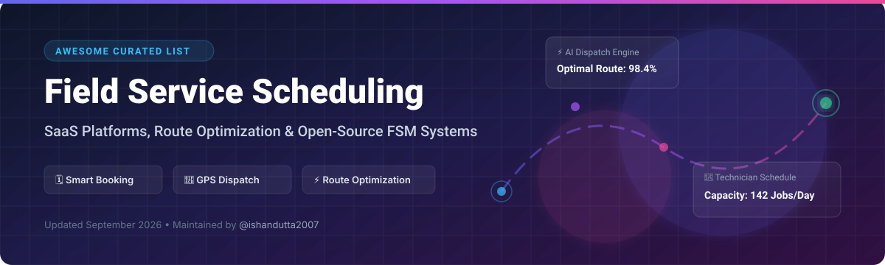

# 🗓️ Awesome Field Service Scheduling 🚀

  
  
  
  
  

---

## 🌟 Top Field Service Scheduling & Dispatch Ecosystem 🚚

> **A curated, SEO-optimized list of top SaaS platforms, open-source GitHub projects, vehicle routing engines, and technician dispatch tools.**  
> *Focused on Appointment Booking, Dynamic Dispatch, Route Optimization, Technician Capacity Planning & Mobile Job Scheduling.*  
> **📅 Last updated: September 2026**

This repository tracks leading **SaaS platforms** and **open-source software** for **Field Service Scheduling (FSM)**. These intelligent systems empower commercial trade contractors, HVAC engineers, plumbers, electricians, and enterprise field fleets to automate job booking, assign technicians based on skills and capacity, optimize delivery and travel routes, and maintain real-time field workforce visibility. 🛠️⚡

---

## 📑 Table of Contents
- [🏢 Market Overview & Size](#-market-overview--size)
- [💼 SaaS & Hosted FSM Platforms](#-saas--hosted-fsm-platforms)
- [🔓 Open-Source GitHub Projects](#-open-source-github-projects)
- [🤝 How to Contribute](#-how-to-contribute)
- [💖 Support & Community](#-support--community)
- [📈 Star History](#-star-history)
- [⚠️ Disclaimer](#-disclaimer)

---

## 🏢 Market Overview & Size 📊

> 💡 **Market Size & Structure**: The global Field Service Management (FSM) and scheduling software market is estimated at **$4.5 Billion – $5.2 Billion** (2025–2026) and is projected to reach over **$9.5 Billion** by 2030 at a CAGR of ~11.8%. The market is **moderately fragmented**—while commercial giants like ServiceTitan dominate high-end specialty contracting and Jobber/Housecall Pro lead SMB trades, hundreds of vertical-specific SaaS solutions and open-source ERP integrations exist to capture specialized market niches.

---

## 💼 SaaS & Hosted FSM Platforms ☁️

Below is a comparison of top field service scheduling platforms, ranked by estimated company valuation / revenue scale:

| 🏢 Platform | 💰 Valuation / Revenue Scale | 🏷️ Starting Pricing | 🎁 Free Tier / Trial Limits | 📌 Key Scheduling & Dispatch Features |
| :--- | :--- | :--- | :--- | :--- |
| **[ServiceTitan](https://www.servicetitan.com/)** 🚀 | **~$9.5B Valuation** ($600M+ ARR) | $300/month (Custom quote per tech) | 14-Day Free Demo (No free perpetual tier) | Enterprise scheduling, capacity planning, intelligent dispatch, full trade operating system. |
| **[Housecall Pro](https://www.housecallpro.com/)** 🏠 | **~$1.4B Valuation** ($100M+ ARR) | $49/month (Basic plan) | 14-Day Free Trial (No free perpetual tier) | Home-services operating system, visual drag-and-drop scheduling, dispatching, automated SMS alerts. |
| **[Jobber](https://getjobber.com/)** 🛠️ | **~$800M Valuation** ($100M+ ARR) | $39/month (Core plan) | 14-Day Free Trial (No free perpetual tier) | Leading SMB platform, online booking, map-based route scheduling, mobile job dispatching. |
| **[Skedulo](https://www.skedulo.com/)** 📅 | **~$400M Valuation** ($40M+ ARR) | $79/user/month | 14-Day Free Demo (No free perpetual tier) | Constraint-based engine, complex workforce scheduling, real-time mid-market dispatch. |
| **[Zuper](https://www.zuper.com/)** ⚡ | **~$150M Valuation** ($15M+ ARR) | $20/user/month | 14-Day Free Trial (No free perpetual tier) | Flexible intelligent scheduling, AI route optimization, dynamic work-order management. |
| **[Service Fusion](https://www.servicefusion.com/)** 🔌 | **~$100M Valuation** ($25M+ ARR) | $166/month (Starter plan) | 14-Day Free Demo (No free perpetual tier) | Unlimited users flat pricing, drag-and-drop dispatch, GPS fleet tracking, invoicing. |
| **[Commusoft](https://www.commusoft.co.uk/)** 🇬🇧 | **~$50M Valuation** ($12M+ ARR) | $29/user/month | 14-Day Free Trial (No free perpetual tier) | UK & European leader, travel-time optimization, real-time engineer tracking, job scheduling. |
| **[FieldPulse](https://www.fieldpulse.com/)** 📲 | **~$40M Valuation** ($8M+ ARR) | $99/month (Includes 2 users) | 7-Day Free Trial (No free perpetual tier) | Full-service SMB platform, technician location tracking, schedule status boards. |
| **[Kickserv](https://www.kickserv.com/)** 📋 | **~$20M Valuation** ($5M+ ARR) | $47/month (Starter plan) | **Free Forever Plan** (Up to 2 users, basic scheduling) | Simple scheduling, job management, customer portal, contractor dispatcher. |
| **[ReachOut](https://www.reachoutfs.com/)** 🗺️ | **~$10M Valuation** ($2M+ ARR) | $10/user/month | **Free Forever Plan** (Up to 3 users, core dispatching) | Affordable FSM solution, mobile form inspection, status visibility, map scheduling. |

---

## 🔓 Open-Source GitHub Projects 📦

Community open-source projects, vehicle routing engines, and ERP extensions for building self-hosted dispatch and field scheduling solutions. *Ranked by GitHub Stars_Count (Descending)*:

- **[odoo/odoo](https://github.com/odoo/odoo)**  🌟  
  Core open-source ERP framework combining project management, field service tasks, calendar scheduling, and resource allocation inside Odoo Community.

- **[frappe/erpnext](https://github.com/frappe/erpnext)**  🌟  
  Open-source enterprise ERP with extensions for technician dispatch, service request management, engineer visit planning, and GPS check-ins.

- **[google/or-tools](https://github.com/google/or-tools)**  🌟  
  Google's fast software suite for combinatorial optimization, vehicle routing problems (VRP), technician capacity planning, and job shop scheduling algorithms.

- **[traccar/traccar](https://github.com/traccar/traccar)**  🌟  
  Leading open-source GPS tracking system supporting real-time vehicle monitoring, engineer location history, and geofencing for field service fleets.

- **[graphhopper/graphhopper](https://github.com/graphhopper/graphhopper)**  🌟  
  Fast open-source road routing engine written in Java; ideal for calculating distance matrices and optimizing technician travel routes.

- **[TimefoldAI/timefold-solver](https://github.com/TimefoldAI/timefold-solver)**  🌟  
  Open-source AI solver (fork of OptaPlanner) for optimizing field technician schedules, shift rosters, appointment slots, and multi-vehicle routing problems.

- **[Vroom-Project/vroom](https://github.com/Vroom-Project/vroom)**  🌟  
  High-performance open-source Vehicle Routing Problem (VRP) optimization engine in C++ designed to solve complex multi-vehicle field dispatch schedules.

- **[pgRouting/pgrouting](https://github.com/pgRouting/pgrouting)**  🌟  
  PostGIS extension providing geospatial routing functionality (TSP, Dijkstra, A*) directly inside PostgreSQL databases for field dispatch backends.

- **[OCA/field-service](https://github.com/OCA/field-service)**  🌟  
  Leading open-source Odoo Community Association (OCA) field service suite—manages work orders, technicians, routes, equipment skills, and scheduling.

---

### 💡 Open-Source Architecture Playbook 🏗️
1. **ERP & Work Orders**: Manage customer accounts, inventory, and job tickets in **Odoo** or **ERPNext**.
2. **Scheduling Modules**: Utilize **OCA Field Service** modules for job dispatch, worker skills, and calendar management.
3. **Route & Shift Optimization**: Integrate **Google OR-Tools**, **Timefold**, or **VROOM** to solve Travelling Salesperson Problems (TSP) and minimize driving mileage.
4. **GPS & Telematics Tracking**: Track field technician vehicles in real-time using **Traccar**.

---

## 🤝 How to Contribute 📝
1. **Fork** the repository 🍴
2. **Create** a branch for your update (`git checkout -b feature/new-fsm-tool`) 🌿
3. **Add/Edit** entries in `README.md` following the tabular & star format 📝
4. **Submit** a Pull Request with a clear summary 🚀

---

## 💖 Support & Community ☕

If you found this curated list helpful for evaluating field service scheduling solutions or building custom dispatch systems, please consider supporting the project!

- ⭐ **Star** this repository on GitHub to show your appreciation.
- 🔄 **Share** with colleagues, dispatchers, and software developers.
- ☕ **Sponsor / Buy me a Coffee**: Support ongoing open-source maintenance via [GitHub Sponsors](https://github.com/sponsors/ishandutta2007).

---

## 📈 Star History

---

## ⚠️ Disclaimer 📜
- This repository is a **community-curated list** for informational and educational purposes.
- Product logos, pricing details, and market valuations are approximate based on publicly available data as of September 2026.
- Field service management systems store critical customer and operational data; ensure appropriate data security, GDPR compliance, and legal safeguards before deploying any commercial or open-source system.

---

  <b>Built with ❤️ for field service leaders, dispatchers, and open-source software engineers.</b>

